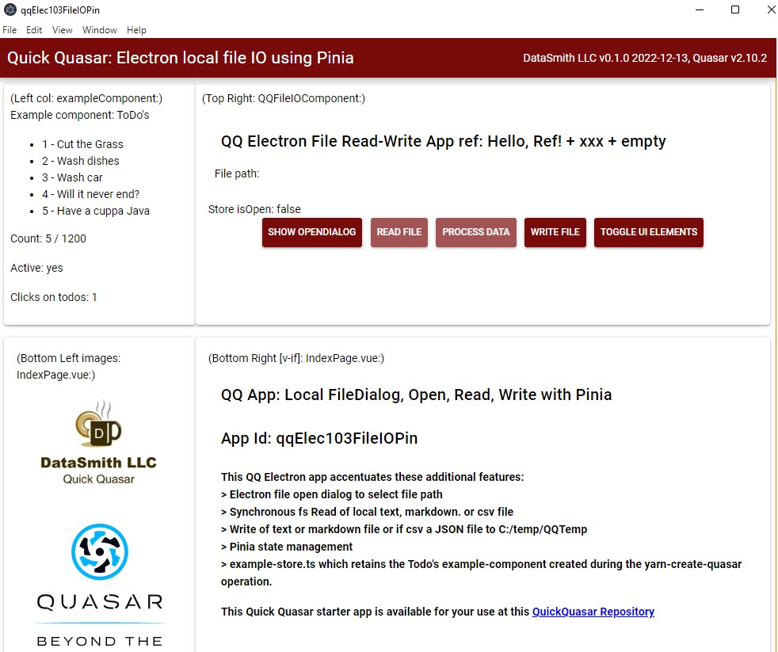

# qqElec103FileIOPin: Quick Quasar Electron with Local File IO using Pinia State Management

## TOC
{:toc}

# Introduction

This distinctive aspect of Electron apps is that they can access local resources. This Quick Quasar app is developed from qq101Base by adding local file read and write, with the objective of performing the IO in the Pinia state management system, making the file information available to all modules.

The crux of this application is getting the Inter-process Communication (IPC) working correctly between the renderer process, the main (Node.js) process, and the Pinia store. Pinia runs as a renderer process, without access to local resources. **DESCRIBE What this is an hopefully in the end how it works!!**

## Objective and Features:

**Opbjective:**  
Perform local file IO from Pinia with access to stored data by several modules.

**Features:**
- Read and process csv spreadsheet text file. This process employs the contextBridge mechanism.

- Output an equivalent JSON text file

- File System window (OpenFileDialog) to select input file

## Input

Any .txt, .csv or .md file; default folder is: C:\temp\QQTemp

The small test files are: 
- qqElec103_TestText.txt  
    this file is simply converted to a array of strings and listed  
- qqElec103_TestCSV.csv  
    this file is converted to an array of JSON objects, each header being an element name.  The first row of the file should contain header columns.  The test file has a simple structure, only several rows with minimal content:
    id     name     quantity
    13    Peaches    5  
- qqElec103_TestMarkdown.md  
    currently this is simply listed; later display the formatted output.  

## Output

Same folder, Output file name = <Input File Name> + _OUT + extension

The CSV JSON-stringified output will be:  
- [{ id: 13, name: "Emmanuel Kant", quantity: 5 }, …]

## User Interface

The User Interface upon opening is below.  Note that the components in each part of the screen are identified to show where that information comes from, but these parenthetical comments may be cleared by toggling the Toggle UI Element button.  

## Resources

[https://www.electronjs.org/docs/latest/api/context-bridge](https://www.electronjs.org/docs/latest/api/context-bridge)

github quasar discussion: [https://github.com/quasarframework/quasar/discussions](https://github.com/quasarframework/quasar/discussions)

OpenDialog:

[https://www.electronjs.org/docs/latest/api/dialog](https://www.electronjs.org/docs/latest/api/dialog)

Current Project / App: qqElec207ExcelOccoONet \<\< What is status of that app??

### My Doco on Quasar V2 with new Elements

Quasar 2 Vue 3 Pinia Vite for QQ (2022-09-21).docx in All Development \> Quasar

## Elements

The elements of this app include those that are common among QQ apps: Quasar V2 (with Vue V3), Pinia, Eslint and optionally TypeScript, which is used in this app, and the D3 system of graphics and other capabilities, such as IO. Because D3 IO is aimed at web applications and does not deal with local files, it is not used in this Electron app, but its powerful graphics capabilites will be accentuated in oter QQ Electron apps.

\*\*\* is this still the case? Really a mess getting to work with Prettier: they don't agree on single quotes; having the autocomplete is often a pain; …

## Log

| **Date** | **Comments** |
| --- | --- |
| 12/10/22 | Started this 7:00 am; wasted the whole day…. Good example not work Quasar |
| 12/11/22 | Reverting to no Pinia and use the "isFile" example that worked; what was problem? |
| 1/5/23 | Getting back to this after spending a bundle of time on OccO – ESCO integration! |
| 1/9/23 | Going crazy with fileOpenDialog – async, etc;NOTE: console.log shows in DevTools window for Renderer!

ToDo:

1. See Steps 12/9
2. DEFER pinia work until IO is working!!
3. Find: the Electron file open dialogue \<\<\< if found provide to github discussion #15013
4. …
5. Following from xmlOwl:
6. Term Analysis: Current processing of labels uses OWL text as array / list – does NOT work well as each node is on multiple lines and we need to focus on "leaves" – detailed occupaitons only and skip BFO, skills and other info
  1. Review the JS Object already created and see if it can be used withoout change
  2. Find a good way to loop through leaves
  3. Find a good set of regular expressions to parcel out label content, such as "of \* worker\*"
  4. Further refine the categorization of occupation terms, tokens and ngrams
7. Results of Term analysis:
  1. What is best form for this – do we need an XLS output? Is one there now?
  2. Need characterization of each term: has or, has comma, compound or simple etc
  3. Distinguish tokens that are simple occup vs tokens only used in combination
8. do a scan and determine what the major nodes are and their content.
9. PUSH TO GITHUB!!

## Steps

Rather than starting from scratch, this app builds on qqElec101Base by copying it and making changes:

Nested list: use 4 spaces in CommonMark, which GitHub uses
* Major Category
    * Minor Category  
        * Sub-category  
    * Minor Category 2  
		* sub again  
* Second major category  
    * minor cat 2.a  
    * etc??  

- 1. Note: Using the D: drive for this series of developments
- 2. Go to parent directory D:\All\_Prog2\_QuickQuasar\QQv2\_Electron for Electron apps
- 3. Copy qqElec101Base to: qqElec103FileIOPin (do not copy Node\_Modules)
- 4. Revise with new program identification
-- a. Description: Quick Quasar Electron app implementing local file IO with Pinia
-- b. vue
-- c. vue
-- d. vue
-- e. …
5. Run npm install
6. Execute with: yarn quasar dev -m electron
7. NOTE for first GitHub: Rather than cophy to D: Github at the outset, go ahead and deveop the app and get it running on the D:\QuickQuasar folder. Once working, copy over (all including NM folder or not?) to Github…
  1. What other steps?
8. Run the app: yarn quasar dev -m electron
  1. What do things look like – how is TS different?
  2. What can be done to enhance the functionality of the base app (without file read)?
9. UI Enhancement – get alignment to work!!
  1. Style standard for buttons, etc.
  2. Nice text output areas – background color?
  3. … did this work? Try yarn quasar new store
  4. 12/7 first try did not work… Error message below indicates some start is needed?
  5. …yarn
10. Change the CSS to DataSmith / Hexplore standard
11. Added 12/9 – Basic operation successful!!
  1. Initial development in D:\QuickQuasar folder – move code (not NM) to d:\github
  2. Do the initial commit to GitHub and inspect how it appears on QuickQuasar organization
  3. Start updating the Readme
  4. Consider the project / organization wiki
  5. Delete C: folder and check total disk capacity
  6. What else? …..

## Problems

1. Got single-quote fix working… not sure how
2. It does not recognize variables in DOM and in script?
3. Reconcile Composiiton patterns: Vue \<script setup\> versus Quasar \<script\> setup()
4. Prettier / eslint problems – see means to disable edits by line or for all
5. Big problem: Quasar Dev Tools window disappears when activate xml commands
  1. Recall: it seems like fs does work??
  2. What is it about xml – is it a Node package while fs is within JavaScript?
  3. …
  4. Trying to see if use of Pinia store will avoid this problem

Pinia related bugs:

### src-electron \> preload.js

What the heck does this do? Alert command in it does not work. It defines functions.

const getXlsx = () =\> {

console.log("I'm getting Excel .xlsx!");

window.myAPI.getXlsx(); // in preload.js

};

### src-electron \> electron-main.js

This is actually where the main logic is! All my processing and output is here, which is easiest to do via the console rather than communicate with a .vue/.ts module with display output.

(How can results in main.js get passed back to the display modules?)

app.whenReady().then(() =\> {

createWindow();

console.log("app is ready");

let outObj = {}; // the output data as JS/JSON Object

// Open input file

const myPath = projectFolder + subFolder + inputFilename;

console.log("Processing Workbook file: " + myPath);

console.log("Processing Worksheet: " + inputSheetname);

const wb = XLSX.readFile(myPath);

const wksht = wb.Sheets[inputSheetname];

const myJson = XLSX.utils.sheet\_to\_json(wksht);

https://medium.com/jspoint/a-beginners-guide-to-creating-desktop-applications-using-electron-824da5665047

browserWindow ...

\_\_dirname

app.whenReady function: ...??

Instead of app.on('ready', handler) approach, you can also use app.whenReady() method which returns a promise. In the then() handler of this promise, you can do what we are doing in the above main.js file.

// More info: [https://v2.quasar.dev/quasar-cli-vite/developing-electron-apps/electron-preload-script](https://v2.quasar.dev/quasar-cli-vite/developing-electron-apps/electron-preload-script)

app.on("activate" \<\< what is this?

[https://www.chromium.org/developers/design-documents/multi-process-architecture/](https://www.chromium.org/developers/design-documents/multi-process-architecture/)

## ISSUE: "\<script\> plus setup" vs "\<script setup\>"

### With \<script\>

We have: Setup() {} and we have the pattern:

### With \<script setup lang="ts"\>

We have the pattern:

@electron/remote

Is this necessary and what is it used for?

